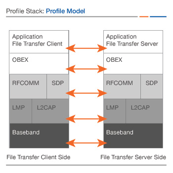

# 蓝牙总结
## 摘要
本文首先介绍了蓝牙技术的基本概念、发展历程和分类,然后重点介绍了在移动平台Android上的技术结构并给出相应的分类分析,
最后在Android平台上做蓝牙开发给出相应的操作介绍。
## 1. 蓝牙技术介绍
蓝牙技术出现于1994年,是使用无线传输技术代替数据线交换数据的一中有效方式,Bluetooth®名字出自于十世纪的丹麦国王Harald Blåtand。 蓝牙技术最流行的应用是链接手持设备或者汽车上的无线耳机。这是一中称之为BR/EDR优化数据传输技术。这个可以更有效率的传输数据。

## 2. 蓝牙技术基本原理Bluetooth® technology
蓝牙设备使用无线代替电缆链接设备,以便于设备之间交换数据,蓝牙设备之间的通信一般在较为短距离进行。几台蓝牙设备在可以建立一个短程的微网,
其中,建立之后有一台可以作为主机使用,其他作为从属(slave)而建立。 设备加入或者离开微网的过程可以动态自动建立的。

1. 蓝牙核心规格2.1版本又被视为基本速率／增强数据率(BR/EDR)，方便将蓝牙设备连接在一起。

2. 高速蓝牙（Bluetooth®）技术让你可以更快捷地在设备间发送视频、音乐和其它大型文件。

3. 低功耗蓝牙(Low Energy; LE)，又视为Bluetooth Smart或蓝牙核心规格4.0版本。是蓝牙技术专为物联网(Internet of Things; IOT)开发的技术。

### 1. BR/EDR

随着简单、安全配对的技术特性引入，蓝牙核心规格2.1版本允许消费者从连接菜单中选择“添加蓝牙设备(add Bluetooth device)”，让设备自动地彼此寻找和连接。

基本速率和增强数据率的不同之处

蓝牙射频（物理层）在2.4GHz未获许可的ISM波段运行。系统采用跳频收发器对抗干扰和衰落，并提供许多FHSS载体。基本速率支持的比特率为1Mbps，而增强数据率支持的总空气比特率为2Mb/s。

### 2. 高速蓝牙技术
采用数据替换方法，通过临时使用消费者设备已有的辅助射频实现更快速的数据吞吐——使用新的射频而无需整合整个系统。高速蓝牙技术在节省成本的同时为未来的应用开发增添了更多可能。

高速蓝牙技术是同步设备之间的音乐库、批量下载图片或从一台设备向另一台设备发送视频文档的理想之选。消费者使用他们已经熟悉的蓝牙协议、配置文件、安全和配对功能可享受功能强大的无线连接乐趣。


### 3. BLE 技术

低功耗蓝牙（Bluetooth®）技术的节能特点，适合需长时间运行且有能源供给需求的设备所采用，例如以纽扣电池为电源供给来源，或兼具能源采集功能的设备。值得一提的是，低功耗蓝牙技术已经取得市面上各主流的操作系统的原生支持，这将便于移动应用的开发，及利于云计算和社会经济效应的连接。


## 3. Android蓝牙技术
Android平台通过Android蓝牙API来让开发者使用这样的技术支持。
蓝牙（Bluetooth）提供移动设备及其配件之间低功耗、低成本的无线通信连接。
蓝牙技术的核心，是根据蓝牙标准所实现的蓝牙协议栈。蓝牙能同时进行异步数据及同步语音传输，它在驱动层之上的底层协议层包括众多协议，
如逻辑链路控制和适配协议（L2CAP）、服务发现协议（SDP）、串口模拟协议（RFCOMM）等，这些协议一起为更上层提供传输支持。
而主要控制接口则由主机控制接口层（HCI,Host Control Interface）体现，HCI是蓝牙协议中软硬件之间的接口。在各种协议及HCI之上，
是蓝牙的上层应用框架，在框架中的单个应用模式称之为一个规范（Profile），便于连接外部不同类型的设备，
如无线耳机使用的A2DP（Advanced Audio Distribution Profile）以及打印机使用的无线打印机服务等，服务有数十种之多。 

用蓝牙技术,可以做到:
> * 扫描其他蓝牙设备
> * 查询已配对蓝牙设备的蓝牙适配器
> * 加强RFCOMM通道
> * 通过service discovery profile来发现其他设备
> * 从其他设备上传输数据
> * 管理多种连接


### 1. Android蓝牙的技术原理
蓝牙（Bluetooth）提供移动设备及其配件之间的无线通信连接。蓝牙技术的核心，是根据蓝牙标准所实现的蓝牙协议栈。蓝牙能同时进行异步数据及同步语音传输，它的底层协议层包括众多协议，如逻辑链路控制和适配协议（L2CAP）、服务发现协议（SDP）、串口模拟协议（RFCOMM）等，一起为上层提供传输支持。而主要控制接口则由主机控制接口层（HCI）体现，它是蓝牙协议中软硬件之间的接口。在各种协议及HCI之上，是蓝牙的上层应用框架，框架里每个应用模式称之为一个Profile，供给外部不同的设备访问，如无线立体声耳机使用的A2DP（Advanced Audio Distribution Profile）以及打印机使用的无线打印机服务等，服务有数十种之多。
Android技术架构:
![image  pic/blueStructure.jpeg)


蓝牙基本架构 

--.  Android提供了对蓝牙的支持。

蓝牙系统的内容包括： 

·Linux内核的蓝牙驱动程序 

·Linux内核的蓝牙协议层 
  包括: GAP, L2CAP, RFCOMM and SDP.

·bluez（运行在UserSpace） 
运行在linux下的核心蓝牙层和协议。支持的协议包括:

| 支持的协议        | name   | 
| :-------:   | :-----:  | 
| A2DP     | Advanced Audio Distribution Profile |  
| AVRCP        |   Audio/Video Remote Control Profile  | 
| DI     | Device Identification Profile |  
| HDP     |Health Device Profile |  
| HID     |Human Interface Device Profile  |  
| PAN     |Personal Area Network Profile |  
| SPP     |Serial Port Profile |  


其中,SPP  Serial Port Profile  串口规格


设备A 和设备B作为虚拟串口,然后用蓝牙技术将其连接。

GATT (LE) 规范:

| 支持的协议        | name   | 
| :-------:   | :-----:  | 
| PXP     | Proximity Profile |  
| HTP        | Health Thermometer Profile    | 
| TIP     |Time Profile |  
| CSCP      |Cycling Speed and Cadence Profile  |  


OBEX 支持规范。（  OBEX: object exchange  ）

可使用“PUT”和“GET”命令实现不同的设备之间的数据传输。

| 支持的协议        | name   | 
| :-------:   | :-----:  | 
| FTP     | File Transfer Profile |  
| OPP        | Object Push Profile    | 
| PBAP     | Phone Book Access Profile|  
| MAP     |Message Access Profile |  

FTP 文件传输规范



 oFono 支持的协议
> * oFono是一个开源免费的电话协议栈软件，可以实现各种电话功能(Voicecall, GPRS, SMS等),一般作为守护进程运行在移动终端上,通过D-Bus接口跟UI通信。
 
| 支持的协议        | name   | 
| :-------:   | :-----:  | 
| HFP     | Hands-Free Profile |  

HFP 免提规范

·bluez适配层 
bluez在Android中的使用，需要经过Android的bluez适配层的封装来实现,适配层构造比较简单，封装了蓝牙的一些基本功能。

·android.bluetooth包中的各个类（蓝牙在框架层的内容） 


·蓝牙相关的应用程序 


### 2. Android蓝牙技术开发指南
接下来主要描述了怎样使用Android蓝牙技术,包括: 建立蓝牙,查找有效的配对设备, 链接设备,发送以及传输数据

一般蓝牙技术开发Android的几个概念:
- [ ]  BluetoothAdapter:  BluetoothAdapter是蓝牙设备使用的主要入口,使用BluetoothAdapter可以发现其他的蓝牙设备,找到一配对的设备,使用一个一直的MAC地址初始化
一个BluetoothDevice,并且通过监听其他设备的通讯来创建BluetoothServerSocket
- [ ]  BluetoothSocket:  蓝牙socket, APP使用这个socket带来的连接通过InputStream和OutStream来交换数据
- [ ]  BluetoothServerSocket: 一个ServerSocket可以用来监听请求接入,为了能连接两个Android设备,其中一个设备必须打开server socket,当一个远程的蓝牙设备
向该设备发起一个连接请求时,该server socket 将会返回一个BluetoothSocket
- [ ]  BluetoothClass:  描述了一个通常的蓝牙设备能力,包括字符characteristics   （只读）,定义了一个设备的大部分和minor的设备clas,然而,这个不仅仅是描述了蓝牙设备profile
和服务支持,  在隐藏设备类型也很有作用。

另外,蓝牙规范:
- [ ]  BluetoothProfile: 一个代表了蓝牙描述规范的接口。 后面需要实现的蓝牙规格需要实现该接口。
- [ ]  BluetoothHeadset: 蓝牙手持设备在移动设备上的支持
- [ ]  BluetoothA2dp: Advanced Audio distribution Profile. 定义了一个蓝牙设备之间通信的高数据流的通信描述
- [ ]  BluetoothHealth: 描述了一个控制蓝牙服务的健康设备描述  这三个是蓝牙接口规格在Android中三个系统实现实例。
- [ ]  BluetoothProfile.ServiceListener  断开和连接service的连接服务时, 这个接口就知会BluetoothProfile IPC 客户端。用于BluetoothProfile
在建立proxy时通过IPC控制设备的主要入口。

蓝牙连接以及数据传输步骤说明:

1.  获取BluetoothAdapter

 list
```java
 BluetoothAdapter mBluetoothAdapter = BluetoothAdapter.getDefaultAdapter();
 if (mBluetoothAdapter == null) {
     // Device does not support Bluetooth
 }
```
 
2.  启动蓝牙enable
```
if (!mBluetoothAdapter.isEnabled()) {
    Intent enableBtIntent = new Intent(BluetoothAdapter.ACTION_REQUEST_ENABLE);
    startActivityForResult(enableBtIntent, REQUEST_ENABLE_BT);
}
```
3.  查找设备

```
// Create a BroadcastReceiver for ACTION_FOUND
private final BroadcastReceiver mReceiver = new BroadcastReceiver() {
    public void onReceive(Context context, Intent intent) {
        String action = intent.getAction();
        // When discovery finds a device
        if (BluetoothDevice.ACTION_FOUND.equals(action)) {
            // Get the BluetoothDevice object from the Intent
            BluetoothDevice device = intent.getParcelableExtra(BluetoothDevice.EXTRA_DEVICE);
            // Add the name and address to an array adapter to show in a ListView
            mArrayAdapter.add(device.getName() + "\n" + device.getAddress());
        }
    }
};
// Register the BroadcastReceiver
IntentFilter filter = new IntentFilter(BluetoothDevice.ACTION_FOUND);
registerReceiver(mReceiver, filter); // Don't forget to unregister during onDestroy
```

4. 列出配对设备

```
Set<BluetoothDevice> pairedDevices = mBluetoothAdapter.getBondedDevices();
// If there are paired devices
if (pairedDevices.size() > 0) {
    // Loop through paired devices
    for (BluetoothDevice device : pairedDevices) {
        // Add the name and address to an array adapter to show in a ListView
        mArrayAdapter.add(device.getName() + "\n" + device.getAddress());
    }
}
```

5. 连接设备  连接过程是一个阻塞过程 

create  socket
```
BluetoothSocket btSocket = device.createRfcommSocketToServiceRecord(MY_UUID_SECURE);  // MY_UUID_INSECURE
```

connect: 
```
   // successful connection or an exception  
   // add try catch 
   // it is block
   btSocket.connect();
```

get data:
```
    // Get the BluetoothSocket input and output streams
    // add try catch
    tmpIn = btSocket.getInputStream();
    tmpOut = btSocket.getOutputStream();
```

6.  作为一个server来连接接受设备, accept阻塞
```
 btSocket = mmServerSocket.accept();
```

实现蓝牙规范
从Android3.0开始,蓝牙API就开始支持蓝牙规格的开发,蓝牙规格（Bluetooth profile）是一个蓝牙设备之间通信的无线接口spec,
手机需要连接到无线手持设备,二者必须都符合手持谷歌说明
如果要实现这种规格说明 必须 实现接口  BluetoothProfile 
Android系统本身也实现了几个:
服务方面支持耳机（Headset）、免提（Handsfree）和立体声（A2DP）等部分。 

1. Headset. 

2. A2DP. Advanced Audio Distribution Profile   立体声耳机等 定义了一个高质量的语音通道, 该语音通道的主要作用通过建立BluetoothA2dp 的一个类
  
3. Health Device. 
以上三者都是建立一个代理proxy,来通过IPC控制一个service 完成后续的


低功耗蓝牙:
低功耗蓝牙主要用在功耗更小的环境下的蓝牙数据通信
低功耗蓝牙BLE的几个主要概念
GATT: 基于BLE的连接基础上发送并接收的短小数据块,目前所有的小功耗的应用规格profile都建立在GATT
SIG协会为低功耗蓝牙定义了很多规范profile,规范profile就是一个设备怎样在一个特定应用上工作的规则。设备可以接收不止一个规范profile。
ATT: GATT就是定义在ATT的基础之上,  ATT优化运行在BLE设备上。  为了达成这个目标,这种ATT属性尽可能的使用较少的字节描述。 每个属性特征
都由UUID定唯一确定的,这是一个128-bit格式的字符串ID来定义唯一的信息。 这个属性由ATT转移并格式成字符Characteristic和服务service。

获取数据的几个概念:

1. 字符 Characteristic—字符包含了0到n个描述了字符值的描述符,一个字符可以被当作一个类型, 看成一个类而存在。
2. 描述符 Descriptors,描述符定义了描述字符值的属性值
3. 服务 service  刻画了一个字符集合


连接 GATT Server

```
mBluetoothGatt = device.connectGatt(this, false, mGattCallback);
```
in case:
```
 // Various callback methods defined by the BLE API.
    private final BluetoothGattCallback mGattCallback =
            new BluetoothGattCallback() {
        @Override
        public void onConnectionStateChange(BluetoothGatt gatt, int status,
                int newState) {
            // TODO
        }

        @Override
        // New services discovered
        public void onServicesDiscovered(BluetoothGatt gatt, int status) {
            // TODO
        }

        @Override
        // Result of a characteristic read operation
        public void onCharacteristicRead(BluetoothGatt gatt,
                BluetoothGattCharacteristic characteristic,
                int status) {
             final Intent intent = new Intent(action);
             // TODO
             sendBroadcast(intent);
        }
```

```
private final BroadcastReceiver mGattUpdateReceiver = new BroadcastReceiver() {
    @Override
    public void onReceive(Context context, Intent intent) {
        final String action = intent.getAction();
        // TODO
    }
};

```


获取GATT通知

```
private BluetoothGatt mBluetoothGatt;
BluetoothGattCharacteristic characteristic;
boolean enabled;
...
mBluetoothGatt.setCharacteristicNotification(characteristic, enabled);
...
BluetoothGattDescriptor descriptor = characteristic.getDescriptor(
        UUID.fromString(SampleGattAttributes.CLIENT_CHARACTERISTIC_CONFIG));
descriptor.setValue(BluetoothGattDescriptor.ENABLE_NOTIFICATION_VALUE);
mBluetoothGatt.writeDescriptor(descriptor);
```

最后在使用结束时关闭client以免占用太多资源。

```
public void close() {
    if (mBluetoothGatt == null) {
        return;
    }
    mBluetoothGatt.close();
    mBluetoothGatt = null;
}
```


